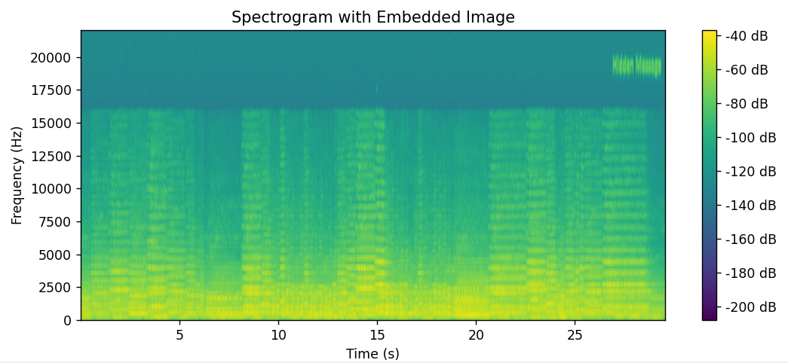
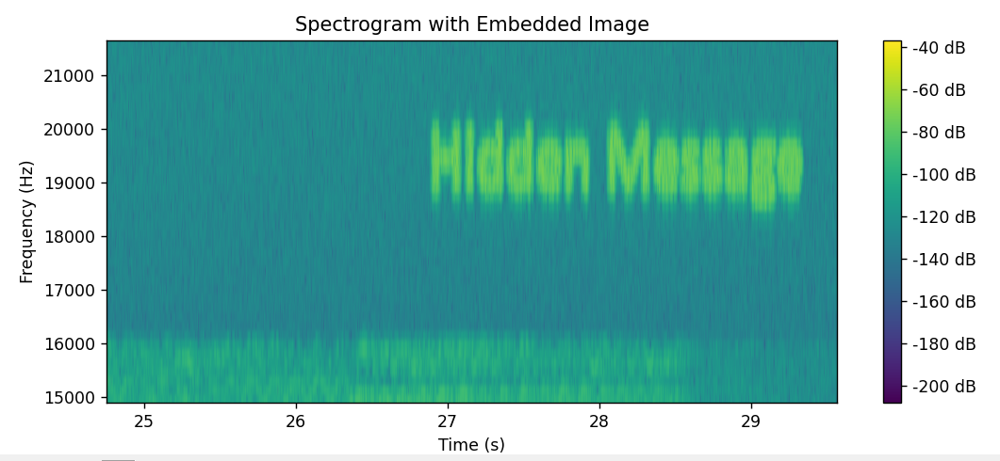

# Audio Steganography with Image Embedding

A simple Python project demonstrating how a grayscale image can be embedded into the spectrogram of an audio file, producing an audio signal that imperceptibly hides visual data.

---

## Contents

- [How It Works](#how-it-works)  
- [Dependencies](#dependencies)  
- [Usage](#usage)  
- [Notes](#notes)  
- [Example](#example)  

---

## How It Works

- Converts the audio file into a spectrogram using **Short-Time Fourier Transform (STFT)**.
- Resizes and normalizes the input image.  
- Embeds the image into a **high-frequency region** of the spectrogram.  
- Reconstructs the audio using **inverse STFT** with the embedded image.  
- Displays a spectrogram of the modified audio to visualize the embedding.

---

## Dependencies

Make sure the following Python libraries are installed:

```bash
pip install numpy librosa matplotlib opencv-python soundfile
```

---

## Usage
1. Clone the repository:
```bash
git clone https://github.com/vesc0/audio-steganography
cd audio-steganography
```

2. Run the script:
```bash
py audio_spectrogram_steganography.py
```

3. Follow the prompts:
    - Enter the path to the input audio file (e.g., .wav, .flac).
    - Enter the path to a grayscale image file (any format supported by OpenCV).
    - Enter the path where you want to save the output audio file.

4. A spectrogram will be displayed showing the embedded image in the high-frequency region of the audio, and the output audio file will be saved.

---

## Notes
- The embedding is done with minimal distortion using a scale factor.
- This is a basic and reversible form of steganography intended for educational purposes.

---

## Example


